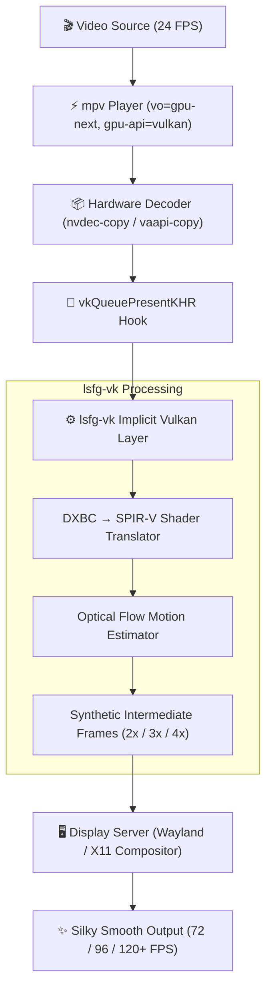

<div align="center">

# 🎬 Lossless Scaling Frame Generation (lsfg-vk) for mpv on Linux

<p align="center">
  <strong>Transform 24 FPS movies and 30/60 FPS videos into silky-smooth 72 FPS / 96 FPS / 120+ FPS playback on Linux using native Vulkan swapchain frame generation.</strong>
</p>

[](https://archlinux.org)
[](https://www.vulkan.org/)
[](https://mpv.io)
[](https://wayland.freedesktop.org/)
[](https://www.nvidia.com/)
[](LICENSE)

<br/>

[✨ Features](#-features) • [⚡ Quick Start](#-quick-start) • [🚀 Usage & Presets](#-usage--cli-options) • [⚙️ Configuration](#-configuration) • [🏗️ Architecture](#-how-it-works) • [🛠️ Troubleshooting](#-troubleshooting)

<hr style="border: 0; height: 1px; background-image: linear-gradient(to right, rgba(0, 0, 0, 0), rgba(255, 255, 255, 0.4), rgba(0, 0, 0, 0));"/>

</div>

## ✨ Features

<table>
  <tr>
    <td width="50%">
      <h3>🚀 2x, 3x & 4x Multipliers</h3>
      <p>Seamlessly boost 24 FPS cinema videos to <b>48 FPS</b>, <b>72 FPS</b>, or <b>96 FPS</b> on high-refresh 120Hz/144Hz/240Hz monitors.</p>
    </td>
    <td width="50%">
      <h3>⚡ Native Vulkan Swapchain Hook</h3>
      <p>Injects interpolated frames directly at the <code>vkQueuePresentKHR</code> layer — no Wine emulation or DirectX overhead.</p>
    </td>
  </tr>
  <tr>
    <td width="50%">
      <h3>📺 YouTube & URL Streaming</h3>
      <p>Built-in streaming integration with optimal cache buffering: simply run <code>lsfg yt "URL"</code>.</p>
    </td>
    <td width="50%">
      <h3>🎛️ Dynamic CLI Controls</h3>
      <p>Adjust multiplier (<code>-m 3</code>), optical flow quality (<code>-f 1.0</code>), performance mode (<code>-p</code>), and HDR (<code>-h</code>) on the fly.</p>
    </td>
  </tr>
</table>

---

## ⚡ Quick Start

### 1. Prerequisites
Ensure you have **Lossless Scaling** installed on Steam, along with `mpv` and Vulkan tools:
```bash
# Arch Linux:
sudo pacman -S mpv vulkan-tools yt-dlp
```

### 2. Automated 1-Click Setup
```bash
# Clone and enter the repository
git clone git@github.com:punitr2007/lsfg-mpv-interpolation-configs.git
cd lsfg-mpv-interpolation-configs

# Run the installer
./install.sh
```

### 3. Enjoy Silky-Smooth 72 FPS Playback!
```bash
lsfg -m 3 -f 1.0 mpv /path/to/movie.mkv
```

---

## 🚀 Usage & CLI Options

The `lsfg` launcher wraps `mpv` and manages Vulkan layer states, configuration updates, and hardware decoding.

```
lsfg [options] <command> [args...]
```

### 🎯 Presets & Common Workflows

```bash
# 🍿 1. Cinematic 3x Interpolation (24 FPS -> 72 FPS at full quality)
lsfg -m 3 -f 1.0 mpv movie.mkv

# ⚡ 2. High-Refresh 4x Interpolation (24 FPS -> 96 FPS for 144Hz+ displays)
lsfg -m 4 -f 1.0 mpv anime.webm

# 📺 3. YouTube Stream Interpolation (Auto buffer & performance tuning)
lsfg yt "https://www.youtube.com/watch?v=..."

# 🔋 4. Low-Power / Battery Saver Mode (Lightweight flow pass)
lsfg -m 2 -f 0.5 -p mpv video.mkv

# 🌈 5. 10-bit HDR Wide Color Gamut Playback
lsfg -m 3 -h mpv 4k_hdr_movie.mkv
```

### 📋 CLI Flags Reference

| Flag | Parameter | Values | Default | Description |
| :--- | :--- | :--- | :--- | :--- |
| **`-m, --multiplier`** | `multiplier` | `2`, `3`, `4` | `3` | Frame generation factor (e.g. $24 \times 3 = 72$ FPS) |
| **`-f, --flow-scale`** | `flow_scale` | `0.5` – `1.0` | `1.0` | Optical flow vector resolution ($1.0$ = highest fidelity) |
| **`-p, --performance`** | `performance_mode` | toggle | `false` | Enables lightweight compute shaders to conserve GPU power |
| **`-h, --hdr`** | `hdr_mode` | toggle | `false` | Enables 10-bit HDR color processing pipeline |
| **`--dll`** | `dll` | `/path/...` | *Steam default* | Custom path to `Lossless.dll` |
| **`--help`** | | | | Display quick command-line reference |

---

## ⚙️ Configuration

### 📄 `~/.config/lsfg-vk/conf.toml`

```toml
version = 1

[global]
dll = "/home/username/.local/share/Steam/steamapps/common/Lossless Scaling/Lossless.dll"

# Application Section for mpv
[[game]]
exe = "mpv"

multiplier = 3
flow_scale = 1.0
performance_mode = false
hdr_mode = false
```

> [!IMPORTANT]
> In **v1** configurations, application rules **must** be enclosed within a `[[game]]` block specifying `exe = "mpv"`. Placing parameters directly under `[global]` causes the layer to silently skip frame interpolation.

---

### 🎛️ `~/.config/mpv/mpv.conf` (Profile `[lsfg]`)

The installer automatically configures or appends the `[lsfg]` profile:

```ini
[lsfg]
vo=gpu-next
gpu-api=vulkan
hwdec=nvdec-copy
hwdec-codecs=all
interpolation=no
video-sync=audio
```

> [!TIP]
> - `hwdec=nvdec-copy` (or `vaapi-copy` on AMD/Intel) prevents device context lockups between CUDA and Vulkan.
> - `interpolation=no` ensures mpv's internal display-resample filter doesn't collide with the Vulkan frame generation layer.

---

## 🏗️ How It Works



For full details, read [docs/ARCHITECTURE.md](docs/ARCHITECTURE.md).

---

## 🛠️ Troubleshooting

<details>
<summary><b>🔍 1. Why does mpv OSD or MangoHud still say 24 FPS?</b></summary>
<br>
MangoHud and mpv's stats measure the <b>upstream decoder rate</b> before Vulkan presentation. The <code>lsfg-vk</code> layer intercepts the presentation queue <i>after</i> mpv renders each frame and injects intermediate frames into the swapchain at 72 FPS. You can observe the interpolation directly in video smoothness.
</details>

<details>
<summary><b>⚠️ 2. Error: <code>Unsupported configuration version (must be 2)</code>?</b></summary>
<br>
The experimental v2 layer requires an unreleased <code>lsfg-vk.dll</code>. The <code>lsfg</code> launcher script automatically disables v2 with <code>DISABLE_LSFGVK=1</code> and routes rendering through the stable v1 DXBC engine.
</details>

<details>
<summary><b>💥 3. Black screen or crash on startup with NVIDIA?</b></summary>
<br>
Ensure your <code>mpv.conf</code> uses copy-back hardware decoding (<code>hwdec=nvdec-copy</code>) rather than direct CUDA headless decoding. Direct CUDA handles can cause device resource race conditions with Vulkan swapchains.
</details>

For more in-depth solutions, check out [docs/TROUBLESHOOTING.md](docs/TROUBLESHOOTING.md).

---

## 📂 Repository Layout

```
lsfg-mpv-interpolation-configs/
├── bin/
│   └── lsfg                               # Universal launcher script
├── config/
│   ├── lsfg-vk/
│   │   ├── conf.toml                      # v1 config with [[game]] mpv section
│   │   └── conf.toml.example              # Multi-game / multi-app config template
│   ├── mpv/
│   │   ├── mpv.conf                       # Complete mpv config with [lsfg] profile
│   │   └── profiles/
│   │       └── lsfg.conf                  # Modular include-able profile snippet
│   └── vulkan/
│       └── VkLayer_LS_frame_generation.json # Vulkan layer manifest template
├── docs/
│   ├── ARCHITECTURE.md                    # Technical deep dive into layer hooking
│   ├── BENCHMARKS_AND_PRESETS.md          # Multiplier & performance presets
│   └── TROUBLESHOOTING.md                 # Common gotchas and fixes
├── install.sh                             # 1-click automated installer
├── LICENSE                                # MIT License
└── README.md                              # Main documentation
```

---

## 📜 License & Credits

- Distributed under the **MIT License**. See [LICENSE](LICENSE) for more information.
- Created for the Linux media & gaming community. Powered by **[Lossless Scaling](https://store.steampowered.com/app/993090/Lossless_Scaling/)** and **`lsfg-vk`**.